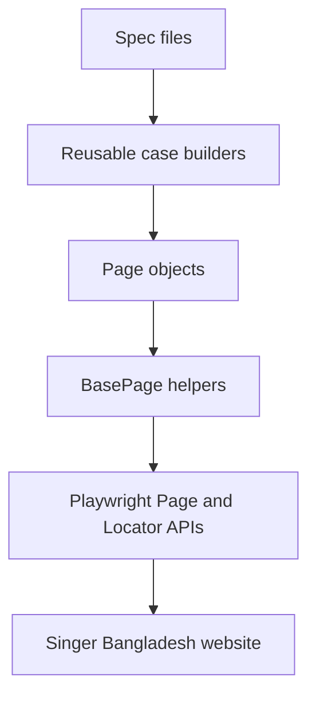

# Singer Bangladesh Playwright Automation


Production-style Playwright TypeScript automation framework for the Singer Bangladesh ecommerce website.

This project demonstrates a production-style UI automation setup: Page Object Model architecture, reusable business test cases, environment switching, tagged execution, multi-browser projects, rich reporting, code quality gates, and optional API/MCP support.

## At A Glance

| Category  | Details                                                                                       |
| --------- | --------------------------------------------------------------------------------------------- |
| Target    | Singer Bangladesh ecommerce website                                                           |
| Stack     | Playwright Test, TypeScript, Node.js, npm                                                     |
| Pattern   | Page Object Model with reusable case builders                                                 |
| Coverage  | Homepage, categories, search, listing, product details, cart, auth, campaign, footer, support |
| Execution | Smoke tags, module specs, full sanity suite, multi-browser projects                           |
| Reporting | Playwright HTML, JUnit XML, Allure results, Allure HTML                                       |
| Quality   | TypeScript strict mode, ESLint, Prettier, Husky, lint-staged                                  |

## Contents

- [Quick Start](#quick-start)
- [Why This Project Stands Out](#why-this-project-stands-out)
- [Command Cheat Sheet](#command-cheat-sheet)
- [Key Features](#key-features)
- [Test Tags](#test-tags)
- [Reports](#reports)
- [Environment Profiles](#environment-profiles)
- [Architecture Overview](#architecture-overview)
- [Project Structure](#project-structure)
- [CI Integration](#ci-integration)

## Quick Start

```bash
npm ci
npx playwright install
npm run quality
npm run test:tag:smoke
```

## Why This Project Stands Out

- Scalable Playwright + TypeScript framework design.
- Maintainable Page Object Model with shared base helpers.
- Module-based sanity coverage with reusable case builders.
- Tagged execution using Playwright `--grep`.
- Multi-browser coverage across Chromium, Firefox, and WebKit.
- Environment-aware execution for `dev`, `staging`, and `prod`.
- Rich reports through Playwright HTML, JUnit XML, and Allure.
- Professional code quality with ESLint, Prettier, Husky, and lint-staged.
- Optional API helpers for API/UI hybrid validation.
- Local MCP server for project metadata and automation tooling.

## Command Cheat Sheet

| Goal                   | Command                       |
| ---------------------- | ----------------------------- |
| Install dependencies   | `npm ci`                      |
| Install browsers       | `npx playwright install`      |
| Run smoke sanity       | `npm run test:tag:smoke`      |
| Run full sanity suite  | `npm run test:sanity`         |
| Run module specs       | `npm run test:sanity:modules` |
| Run regression suite   | `npm run test:regression`     |
| Run visual checks      | `npm run test:visual`         |
| Run quality gate       | `npm run quality`             |
| Open Playwright report | `npm run report:html`         |
| Generate Allure report | `npm run report:allure`       |
| Open Allure report     | `npm run report:allure:open`  |
| Start MCP server       | `npm run mcp:server`          |

## Key Features

| Area             | Capability                                                               |
| ---------------- | ------------------------------------------------------------------------ |
| Test runner      | Playwright Test with TypeScript strict mode                              |
| Architecture     | Page Object Model, reusable case builders, shared fixtures               |
| Browser coverage | Chromium, Firefox, WebKit projects                                       |
| Test selection   | Module specs and grep-friendly tags such as `@smoke`, `@cart`, `@search` |
| Environments     | `.env`, `environments/dev.env`, `staging.env`, `prod.env`, CI overrides  |
| Reports          | Playwright HTML, JUnit XML, Allure results, Allure HTML                  |
| Visual checks    | Component screenshot baselines for critical storefront UI                |
| Quality          | ESLint, Prettier, Husky pre-commit, lint-staged                          |
| API support      | Typed API client, models, and catalog domain agent                       |
| MCP support      | Local stdio MCP server exposing project metadata                         |

## Documentation

- [Architecture diagrams](docs/architecture.md)
- [Environment switching](docs/environments.md)
- [Agent guide](docs/agent.md)
- [Agent progress handoff](docs/AGENT_PROGRESS.md)
- [Imported sibling repo walkthrough](docs/walkthrough.md)

## Prerequisites

- Node.js 20+
- npm 10+
- Playwright browsers installed with `npx playwright install`

## Commands By Goal

### Setup

```bash
npm ci
npx playwright install
```

### Run Sanity

```bash
npm test
npm run test:sanity
npm run test:sanity:modules
npm run test:regression
```

### Run By Tag

```bash
npm run test:tag:smoke
npm run test:tag:cart
npm run test:tag:search
```

Equivalent direct Playwright commands:

```bash
npx playwright test tests-ts/sanity/sanity.spec.ts --grep @smoke
npx playwright test tests-ts/sanity/sanity.spec.ts --grep @cart
npx playwright test tests-ts/sanity/sanity.spec.ts --grep "@sanity|@search"
```

Use the central suite path with `--grep` when you want one execution path. Running `--grep` across the whole repository also includes standalone module specs.

### Run By Browser

```bash
npx playwright test --project=chromium
npx playwright test --project=firefox
npx playwright test --project=webkit
```

Combine browser projects with tags:

```bash
npx playwright test tests-ts/sanity/sanity.spec.ts --project=chromium --grep @smoke
npx playwright test tests-ts/sanity/sanity.spec.ts --project=firefox --grep @cart
npx playwright test tests-ts/sanity/sanity.spec.ts --project=webkit --grep @search
```

### Run One Module

```bash
npx playwright test tests-ts/sanity/footer.spec.ts
npx playwright test tests-ts/sanity/cart.spec.ts
```

### Debug

```bash
npm run test:headed
npm run test:ui
HEADED=true npx playwright test tests-ts/sanity/authentication.spec.ts
```

### Run Quality Checks

```bash
npm run typecheck
npm run lint
npm run lint:fix
npm run format
npm run format:check
npm run quality
```

`npm run quality` runs TypeScript checking, ESLint, and Prettier validation together.

### Generate Reports

```bash
npm run test:sanity
npm run report:html
npm run report:allure
npm run report:allure:open
```

### Run Visual Regression

```bash
npm run test:visual
npm run test:visual:update
```

`test:visual` compares the homepage header and hero against committed baselines. Use `test:visual:update` only when an
intentional visual change should become the new baseline.

### Start MCP Server

```bash
npm run mcp:server
```

## Test Tags

Tests use grep-friendly tags in their titles.

| Tag         | Purpose                          |
| ----------- | -------------------------------- |
| `@sanity`   | All sanity tests                 |
| `@smoke`    | Smallest high-signal smoke check |
| `@homepage` | Homepage checks                  |
| `@category` | Category page checks             |
| `@search`   | Product search checks            |
| `@listing`  | Product listing checks           |
| `@product`  | Product details checks           |
| `@cart`     | Add-to-cart and cart page checks |
| `@auth`     | Login/authentication UI checks   |
| `@campaign` | Campaign page checks             |
| `@footer`   | Footer navigation checks         |
| `@support`  | FAQ and store locator checks     |

Example:

```bash
npx playwright test tests-ts/sanity/sanity.spec.ts --grep @cart
```

## Reports

Each Playwright run produces multiple report formats.

| Report          | Output                           | Purpose                                                       |
| --------------- | -------------------------------- | ------------------------------------------------------------- |
| Playwright HTML | `playwright-report/`             | Local debugging, traces, screenshots, and demo screenshots    |
| JUnit XML       | `test-results/junit/results.xml` | CI test result publishing and build integrations              |
| Allure results  | `allure-results/`                | Raw Allure result files generated during test execution       |
| Allure HTML     | `allure-report/`                 | Rich shareable execution report generated from Allure results |

Open reports:

```bash
npm run report:html
npm run report:allure
npm run report:allure:open
```

## Demo Screenshots

For portfolio/demo use, generate reports and capture:

- Playwright HTML report summary.
- A failed-test trace view, when available.
- Allure overview dashboard.
- Allure suite or test-case detail page.

Recommended location for committed demo images:

```text
docs/assets/
```

Keep generated report folders ignored. Commit only curated screenshots that are useful for documentation.

## Environment Profiles

Environment files live in `environments/`.

```text
environments/
├── dev.env
├── staging.env
└── prod.env
```

Run with a profile:

```bash
TEST_ENV=dev npm run test:sanity
TEST_ENV=staging npm run test:sanity:modules
TEST_ENV=prod npm run test:prod
```

Load order:

1. `.env`
2. `environments/<TEST_ENV>.env`
3. shell or CI variables

Shell and CI variables override env files. See [docs/environments.md](docs/environments.md) for details.

Playwright runs `tests-ts/fixtures/globalSetup.ts` before tests start. The setup script loads the selected environment
with `getSettings()` and performs a lightweight reachability check against `BASE_URL`, failing fast when the target
environment is misconfigured or unavailable.

## Architecture Overview



More diagrams are available in [docs/architecture.md](docs/architecture.md):

- POM flow
- fixture flow
- execution flow
- API/UI flow

## Project Structure

```text
Singer_BD_Automation/
├── .github/
│   └── workflows/
│       ├── sanity.yml                # Push/PR sanity test workflow
│       └── regression.yml            # Scheduled and manual regression workflow
│
├── README.md                         # Main project guide
├── package.json                      # npm scripts and dependencies
├── package-lock.json                 # Locked dependency versions
├── playwright.config.ts              # Playwright test runner configuration
├── tsconfig.json                     # TypeScript compiler configuration
├── test_case.json                    # Test case source/reference data
│
├── environments/                     # Environment-specific runtime settings
│   ├── dev.env                       # Development environment values
│   ├── staging.env                   # Staging environment values
│   └── prod.env                      # Production environment values
│
├── scripts/                          # Utility scripts
│   └── update-docs.mjs               # Regenerates README/agent docs when used
│
├── docs/                             # Supporting markdown documentation
│   ├── agent.md                      # Agent/framework summary document
│   ├── AGENT_PROGRESS.md             # Handoff notes for long agent sessions
│   ├── architecture.md               # POM, fixture, execution, and API/UI diagrams
│   ├── environments.md               # Environment switching and CI variable guide
│   ├── walkthrough.md                # Imported WebdriverIO repo reference notes
│   └── debug/                        # Debug captures and page snapshots
│       ├── live-home.md              # Captured homepage/debug notes
│       └── snapshot.md               # Playwright accessibility snapshot reference
│
├── src/                              # Framework source code
│   ├── config.ts                     # Loads .env and environments/*.env settings
│   ├── exceptions.ts                 # Custom error classes for clearer failures
│   │
│   ├── api/                          # Optional API support layer
│   │   ├── client.ts                 # Fetch wrapper with timeout/retry/JSON parsing
│   │   ├── models.ts                 # Typed Category/Product model mapping
│   │   └── agents/
│   │       └── catalogAgent.ts       # Catalog API domain wrapper
│   │
│   ├── pages/                        # Page Object Model files
│   │   ├── basePage.ts               # Shared navigation, wait, click, modal helpers
│   │   ├── homePage.ts               # Homepage locators and search action
│   │   ├── categoryPage.ts           # Category/listing page locators and navigation
│   │   ├── productPage.ts            # Product details and add-to-cart actions
│   │   ├── cartPage.ts               # Cart page locators and navigation
│   │   ├── loginPage.ts              # Login panel locators and open action
│   │   ├── campaignPage.ts           # Campaign page navigation
│   │   ├── footerPage.ts             # Footer link navigation
│   │   ├── searchPage.ts             # Search results locators
│   │   └── supportPage.ts            # FAQ and store locator locators
│   │
│   ├── utils/
│   │   └── url.ts                    # URL/slug parsing helpers
│   │
│   └── mcp/
│       └── server.ts                 # Local MCP server
│
├── tests-ts/                         # Playwright test code
│   ├── data/                         # Test data sources
│   │   ├── search-keywords.json      # Data-driven search keywords
│   │   └── searchKeywords.ts         # Typed keyword export
│   │
│   ├── fixtures/
│   │   ├── dataFactory.ts            # API-backed live test data helpers
│   │   ├── singerTest.ts             # Shared test fixture and cleanup logic
│   │   └── globalSetup.ts            # Pre-test environment reachability check
│   │
│   └── sanity/                       # Sanity test suite
│       ├── sanity.spec.ts            # Central full sanity suite
│       ├── homepage.spec.ts          # Standalone homepage suite
│       ├── category.spec.ts          # Standalone category suite
│       ├── search.spec.ts            # Standalone search suite
│       ├── product-listing.spec.ts   # Standalone product listing suite
│       ├── product-details.spec.ts   # Standalone product details suite
│       ├── cart.spec.ts              # Standalone cart suite
│       ├── authentication.spec.ts    # Standalone login/authentication suite
│       ├── campaign.spec.ts          # Standalone campaign suite
│       ├── footer.spec.ts            # Standalone footer suite
│       ├── support.spec.ts           # Standalone FAQ/store locator suite
│       │
│       └── cases/                    # Reusable test case builders
│           ├── index.ts              # Re-exports all case builders
│           ├── homepage.ts           # SANITY_001/SANITY_011/SANITY_014 homepage checks
│           ├── category.ts           # SANITY_002/SANITY_015 category checks
│           ├── search.ts             # SANITY_003 product search
│           ├── productListing.ts     # SANITY_004/SANITY_012 listing products
│           ├── productDetails.ts     # SANITY_005/SANITY_013 product details page
│           ├── cart.ts               # SANITY_006/SANITY_007 cart flows
│           ├── authentication.ts     # SANITY_008/SANITY_016 login checks
│           ├── campaign.ts           # SANITY_009/SANITY_017 campaign page
│           ├── footer.ts             # SANITY_010/SANITY_018 footer links
│           └── support.ts            # SANITY_019/SANITY_020 support checks
│
│   └── visual/                       # Visual regression suite and baselines
│       ├── homepage.visual.spec.ts   # Homepage header and hero screenshot checks
│       └── homepage.visual.spec.ts-snapshots/
│
├── test-results/                     # Generated failure artifacts; ignored
├── playwright-report/                # Generated Playwright HTML report; ignored
├── allure-results/                   # Generated Allure result files; ignored
├── allure-report/                    # Generated Allure HTML report; ignored
└── node_modules/                     # Installed dependencies; ignored
```

## Layer Responsibilities

| Layer        | Location                          | Responsibility                                         |
| ------------ | --------------------------------- | ------------------------------------------------------ |
| Specs        | `tests-ts/sanity/*.spec.ts`       | Suite entry points and grouping                        |
| Cases        | `tests-ts/sanity/cases/*.ts`      | Business flow and assertions                           |
| Fixtures     | `tests-ts/fixtures/*.ts`          | Shared Playwright setup, cleanup, and live test data   |
| Visual specs | `tests-ts/visual/*.spec.ts`       | Screenshot baseline checks for critical UI components  |
| Page objects | `src/pages/*.ts`                  | Locators and reusable UI actions                       |
| Base helpers | `src/pages/basePage.ts`           | Navigation, waits, modal handling, robust clicks       |
| API client   | `src/api/client.ts`               | HTTP transport, retry, status validation, JSON parsing |
| API agents   | `src/api/agents/*.ts`             | Domain-level API wrappers                              |
| Config       | `src/config.ts`                   | Environment loading and validation                     |
| MCP          | `src/mcp/server.ts`               | Local MCP metadata and tooling surface                 |

## Current Sanity Coverage

| ID           | Area            | Check                                                       | Tags                       |
| ------------ | --------------- | ----------------------------------------------------------- | -------------------------- |
| `SANITY_001` | Homepage        | Loads page title, header, and search controls               | `@sanity @smoke @homepage` |
| `SANITY_002` | Category        | Opens the Small Appliances category page                    | `@sanity @category`        |
| `SANITY_003` | Search          | Returns product results for configured search keywords      | `@sanity @search`          |
| `SANITY_004` | Listing         | Shows products for the Washing Machine category             | `@sanity @listing`         |
| `SANITY_005` | Product details | Opens PDP for a live in-stock product and validates core UI | `@sanity @product`         |
| `SANITY_006` | Cart            | Adds a live in-stock product to cart                        | `@sanity @cart`            |
| `SANITY_007` | Cart            | Opens the cart page directly and detects a known cart state | `@sanity @cart`            |
| `SANITY_008` | Auth            | Opens the login modal from homepage                         | `@sanity @auth`            |
| `SANITY_009` | Campaign        | Opens campaign page and validates EMI content               | `@sanity @campaign`        |
| `SANITY_010` | Footer          | Navigates to Terms and Conditions from the footer           | `@sanity @footer`          |
| `SANITY_011` | Homepage        | Shows homepage category navigation links                    | `@sanity @homepage`        |
| `SANITY_012` | Listing         | Exposes product detail links from listing cards             | `@sanity @listing`         |
| `SANITY_013` | Product details | Shows at least one product image on PDP                     | `@sanity @product`         |
| `SANITY_014` | Homepage        | Renders visible footer content on homepage                  | `@sanity @homepage`        |
| `SANITY_015` | Category        | Loads the Washing Machine category listing shell            | `@sanity @category`        |
| `SANITY_016` | Auth            | Shows the login entry point on homepage                     | `@sanity @auth`            |
| `SANITY_017` | Campaign        | Renders campaign page body independent of promo copy        | `@sanity @campaign`        |
| `SANITY_018` | Footer          | Shows the Terms and Conditions footer link                  | `@sanity @footer`          |
| `SANITY_019` | Support         | Filters FAQ questions by search keyword                     | `@sanity @support`         |
| `SANITY_020` | Support         | Shows store locator contact and direction actions           | `@sanity @support`         |

The central suite contains 22 sanity tests per browser because `SANITY_003` runs once per keyword in `tests-ts/data/search-keywords.json`.

## Adding A New Sanity Test

1. Add or update a page object in `src/pages/`.
2. Add or update a case file in `tests-ts/sanity/cases/`.
3. Export new case builders from `tests-ts/sanity/cases/index.ts`.
4. Add the case builder to `tests-ts/sanity/sanity.spec.ts`.
5. Optionally add a standalone module spec.
6. Add meaningful tags such as `@smoke`, `@cart`, or `@search`.
7. Run the quality gate and targeted test.

```bash
npm run quality
npx playwright test tests-ts/sanity/sanity.spec.ts --grep @smoke
```

## Debugging Failed Tests

Generated artifacts:

- `test-results/`: screenshots, videos, traces, JUnit XML, error context
- `playwright-report/`: Playwright HTML report
- `allure-results/`: raw Allure result files
- `allure-report/`: generated Allure HTML report

Useful commands:

```bash
npm run report:html
npx playwright show-trace test-results/<trace-file>/trace.zip
HEADED=true npx playwright test tests-ts/sanity/authentication.spec.ts
```

## MCP Server

The local MCP server lives in `src/mcp/server.ts`.

It exposes:

- Resource: `singerbd://docs/readme`
- Tool: `list_npm_scripts`

Run it directly:

```bash
npm run mcp:server
```

Example MCP client config:

```json
{
  "mcpServers": {
    "singerbd": {
      "command": "npm",
      "args": ["run", "mcp:server"],
      "cwd": "/Users/atiarrahmanchowdhury/Singer_BD_Automation"
    }
  }
}
```

The same server is also declared in `.mcp.json` for MCP clients that support project-local configuration.

## CI Integration

The framework is CI-ready through deterministic commands and report outputs.

Playwright runs independent tests in parallel. CI is capped at 2 workers through `playwright.config.ts`; local runs use
Playwright's default worker selection. Cart tests are kept in a serial group because they mutate guest cart state.

Recommended CI steps:

```bash
npm ci
npx playwright install --with-deps
npm run quality
npm run test:sanity
npm run report:allure
```

GitHub Actions workflows:

- `.github/workflows/sanity.yml` runs typecheck and Chromium sanity tests on every push to `main`, pull request, and manual dispatch.
- `.github/workflows/regression.yml` runs typecheck and Chromium regression tests on a daily cron schedule and manual dispatch.

Useful CI artifacts:

- `test-results/`
- `playwright-report/`
- `allure-results/`
- `allure-report/`
- `test-results/junit/results.xml`

## Maintenance Notes

- If a selector breaks, update the matching page object in `src/pages/`.
- If a modal blocks clicks, check `BasePage.dismissBlockingModals()`.
- If a click is flaky, check `BasePage.clickWhenReady()`.
- If cart behavior changes, update `CartPage.getCartState()`.
- If search behavior changes, update `HomePage.searchFor()` and `SearchPage`.
- If environment selection fails, check `src/config.ts` and `environments/*.env`.
- If API response shape changes, update `src/api/models.ts` and `src/api/agents/catalogAgent.ts`.

## References

- [Playwright documentation](https://playwright.dev/docs/intro)
- [Allure Playwright documentation](https://allurereport.org/docs/playwright/)
- [TypeScript documentation](https://www.typescriptlang.org/docs/)
