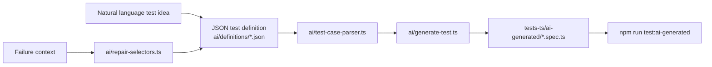

# AI-Assisted Test Workflow

This repository includes a deterministic AI-assisted testing workflow for turning structured test ideas into runnable
Playwright specs.

## Workflow



## Commands

```bash
npm run ai:generate-tests
npm run test:ai-generated
npm run ai:repair-selectors -- --failure=test-results/<case>/error-context.md
```

## How To Use This Day To Day

Use the AI-assisted workflow for a fast idea-to-test loop:

1. Write a JSON test idea in `ai/definitions/`.
2. Generate the Playwright spec:
   ```bash
   npm run ai:generate-tests
   ```
3. Run only generated tests:
   ```bash
   npm run test:ai-generated
   ```
4. If a selector fails, run repair scoring with the Playwright failure context:
   ```bash
   npm run ai:repair-selectors -- --failure=test-results/<case>/error-context.md
   ```
5. Review the ranked selector candidates, update the JSON definition or page object, then regenerate.

This is most useful when adding smoke coverage, validating new page ideas, trying selector alternatives, or creating a
draft spec before promoting the flow into hand-written sanity/regression coverage.

## Fast Feedback Strategy

Use different commands depending on the amount of confidence needed:

| Situation                 | Command                                  |
| ------------------------- | ---------------------------------------- |
| Quick local confidence    | `npm run test:tag:smoke`                 |
| Rebuild definitions       | `npm run ai:definitions:from-catalog`    |
| Validate generated specs  | `npm run test:ai-generated`              |
| Before pushing code       | `npm run quality && npm run test:sanity` |
| Deeper scheduled coverage | `npm run test:regression`                |
| Accessibility confidence  | `npm run test:a11y`                      |
| Visual/layout confidence  | `npm run test:visual`                    |

Generated tests are intentionally fast and focused. Treat them as a draft and acceleration layer, then move durable
business-critical flows into the standard sanity or regression suites after review.

## Definition Format

JSON definitions describe test intent, risk, tags, and executable steps:

```json
{
  "id": "AI_SMOKE_001",
  "title": "AI generated homepage smoke should expose search",
  "tags": ["@ai", "@smoke", "@homepage"],
  "purpose": "demonstrates JSON-to-Playwright generation for a high-value homepage smoke check.",
  "risk": "AI-generated tests drifting from framework fixtures, selector conventions, or homepage accessibility expectations.",
  "steps": [
    { "action": "goto", "path": "/" },
    { "action": "expectTitle", "pattern": "Singer" },
    {
      "action": "expectVisible",
      "selector": {
        "description": "Homepage search input",
        "css": "input[name='search'], input[placeholder*='Search'], input[type='search']",
        "candidates": ["input[name='search']", "input[placeholder*='Search']"]
      }
    }
  ]
}
```

## Selector Repair

`ai/repair-selectors.ts` reads selector candidates from JSON definitions, optionally filters them using a Playwright
failure context file, opens the configured Singer environment, and ranks candidates by match count and visible match
count. This keeps AI-assisted selector repair reviewable instead of silently rewriting tests.

## Self-Healing Locator Strategy

Runtime locator resilience lives in `BasePage`. Page objects can define a primary selector, fallback selectors, text
hints, and attribute hints. At runtime the framework:

1. Tries the primary selector.
2. Retries ranked fallback selectors.
3. Uses DOM-similarity scoring when explicit selectors fail.
4. Returns the recovered locator for the assertion or action.

This complements `ai/repair-selectors.ts`: runtime healing keeps the test moving when markup changes slightly, while
selector repair produces reviewable candidates for durable source updates.

## Guardrails

- Generated specs import the shared Singer fixture so static asset routing and cleanup behavior stay consistent.
- JSON definitions are schema-validated with `zod` before code generation.
- Generated specs are kept in `tests-ts/ai-generated/` and run through `npm run test:ai-generated`.
- Human review is still required before committing generated test definitions or selector changes.
