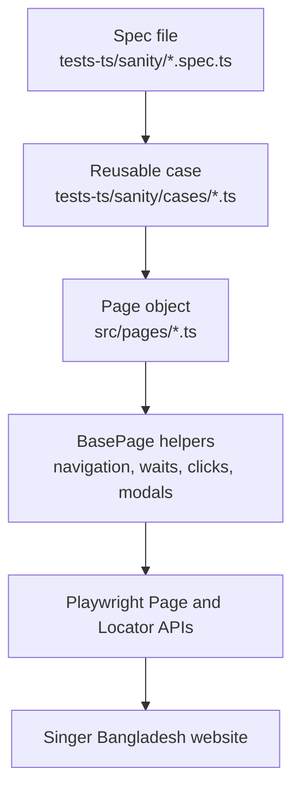
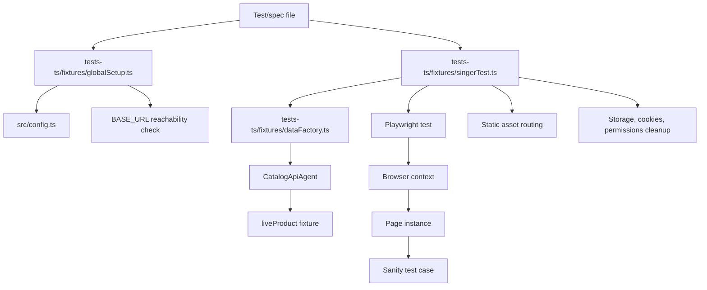
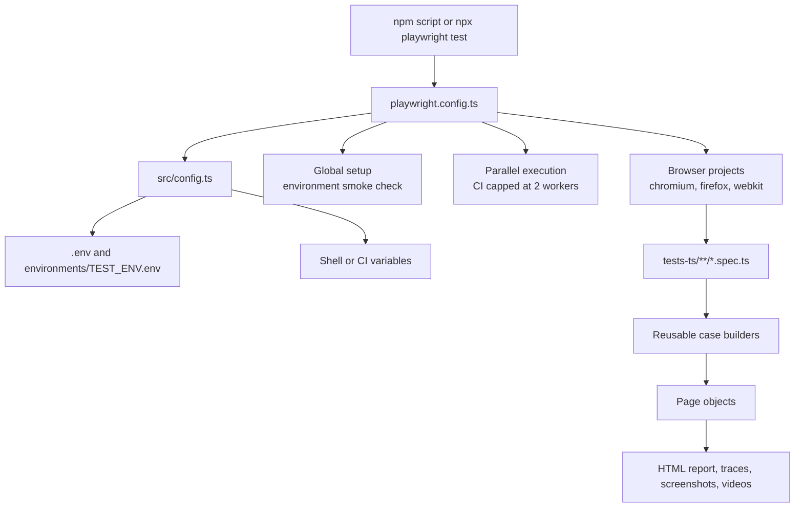
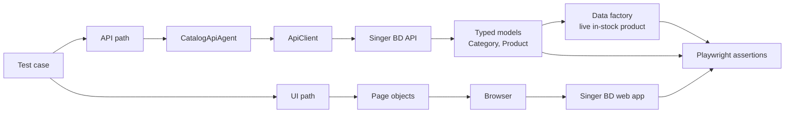
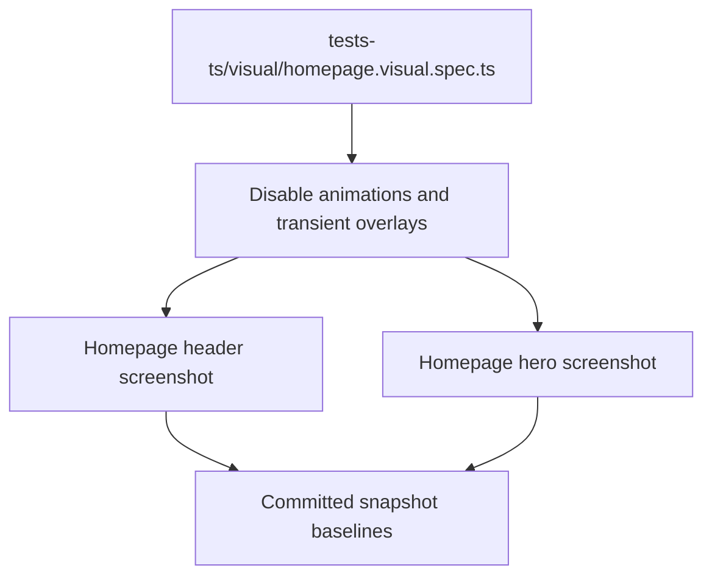

# Architecture

This project is organized as a Playwright TypeScript automation framework with clear separation between specs, reusable test cases, page objects, fixtures, configuration, and optional API helpers.

## POM Flow

Page Object Model keeps locators and reusable browser actions out of test assertions.

## Fixture Flow

All tests import the shared fixture instead of importing directly from Playwright.

## Execution Flow

Runtime settings are resolved before Playwright starts the selected browser projects.

## API/UI Flow

The framework can combine UI checks with typed API helpers when a test needs faster setup or backend validation.

## Visual Flow

Critical storefront UI can be checked against committed screenshots.

## Responsibility Map

| Layer        | Location                          | Responsibility                                     |
| ------------ | --------------------------------- | -------------------------------------------------- |
| Specs        | `tests-ts/sanity/*.spec.ts`       | Suite entry points and grouping.                   |
| Cases        | `tests-ts/sanity/cases/*.ts`      | Business test flow and assertions.                 |
| Fixtures     | `tests-ts/fixtures/*.ts`          | Shared setup, cleanup, global checks, live data.   |
| Visual Specs | `tests-ts/visual/*.spec.ts`       | Screenshot baselines for critical UI components.   |
| Page Objects | `src/pages/*.ts`                  | Locators and reusable UI actions.                  |
| Base Helpers | `src/pages/basePage.ts`           | Navigation, waits, modal handling, robust clicks.  |
| API Client   | `src/api/client.ts`               | HTTP transport, timeout, retry, JSON parsing.      |
| API Agents   | `src/api/agents/*.ts`             | Domain-specific API operations.                    |
| Config       | `src/config.ts`                   | Environment loading and validation.                |
| MCP          | `src/mcp/server.ts`               | Local MCP metadata and automation tooling surface. |
